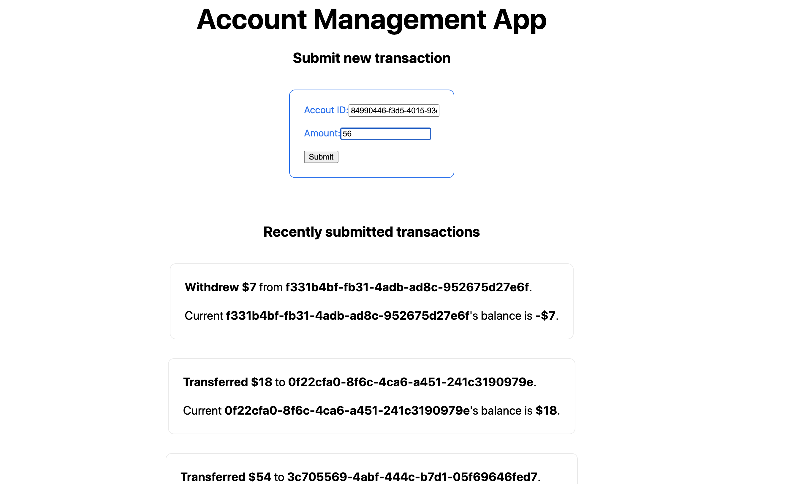

# Account Management Frontend - Level 3

**Before you get started, please read [this guide](https://www.notion.so/Get-started-with-your-assignment-dade100d93054a6db1036ce294bdaeb6)** that walks you through how to submit your solution and get help.

### Time limit ⏳

Try not to spend more than **3 hours**.

### The challenge 🎯

Your task is to build a Frontend app that integrates with a predefined backend service. The backend service implements this [API specification](api-specification.yml) that defines a set of operations for creating and reading account transactions. You can use [editor.swagger.io](https://editor.swagger.io/) to visualize the spec.

#### App mockup 🧱

#### App specification 📘
* There's a form with two input fields: Account ID and Amount. Whenever the form is submitted, a new transaction with the collected data should be created on the backend, and the corresponding input fields are cleared. The HTML elements must have the following HTML attributes:
  * Account ID input field: `data-type="account-id"`
  * Amount input field: `data-type="amount"`
  * Form: `data-type="transaction-form"`
* There's a list of the previously submitted transactions. Every newly submitted transaction should appear at the top of the list. The HTML element that represents a transaction should include the following HTML attributes: `data-type=transaction`, `data-account-id={transaction-account-id}`, `data-amount={transaction-amount}`, and `data-balance={current-account-balance}`
* A warning message should appear if there was an attempt to submit a duplicate transaction within 5 seconds from the original one. The message should say: `You need to wait for 5 seconds before sending a duplicate transaction.`. The transaction should not be created on the server in this case. The warning message HTML element should have the following HTML attribute: `data-type=warning-message`.

### The focus areas 🔍
- **Integrate with a REST API**. Using the provided API spec, figure out the right service endpoints to use.
- **Implement client-side form data validation**. The API has restrictions on the allowed data format. Make sure to do the required checks client-side before sending the data to the server.
- **Organize your code with components**. Extract components that help you avoid duplication, but don't break things apart needlessly. We want to see that you can implement the UI with sound HTML semantics.
- **Implement graceful handling of network failures**. Your app should provide a way for re-sending failed transactions. A transaction might fail to send due to one of the following reasons:
  - The backend is down.
  - The browser has no Internet connection.
  - The backend returns an HTTP 5xx error.
- **Document your choices**. Extend this README.md with info about how to run your application along with any hints that will help us review your submission and better understand the decisions you made. Specifically, please describe your solution for re-sending failed transactions.

### The provided boilerplate 🗂
* The [service specification](api-specification.yml) in the Open API format.
* Automated tests to validate your solution. To run locally:
  * Install the required test dependencies with `yarn install` (please give it some time to download the necessary dependencies).
  * Update the `baseUrl` (where your app will run) in [cypress.json](cypress.json).
  * Spin up the provided backend service with `yarn run start:backend` (restart after every test run).
  * Run your app.
  * Run the tests with `yarn run test`.

### Before submitting your solution ⚠️
1. Update the `baseUrl` (where your app will run) in [cypress.json](cypress.json).
2. Update the [`build:frontend`](package.json#L5) and [`start:frontend`](package.json#L6) scripts in [package.json](package.json) that respectively build and run your application. **[See examples](https://www.notion.so/Frontend-c614dbc47cca407788a29c3130cc1523)**.

---

Made by [DevSkills](https://devskills.co). 

How was your experience? **Give us a shout on [Twitter](https://twitter.com/DevSkillsHQ) / [LinkedIn](https://www.linkedin.com/company/devskills)**.
